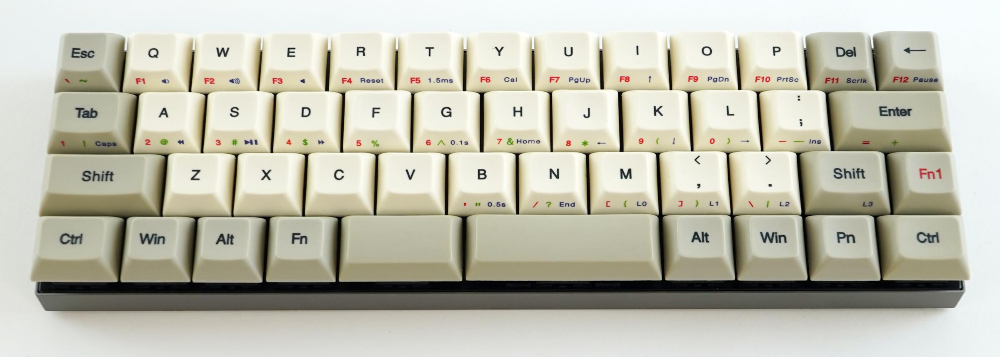

# Vortex core

## Customize key map
1. Create custom keymap on [https://tsdo.in/much-programming-core/](https://tsdo.in/much-programming-core/) then download layout.cys file clicking \[Generate Binary (Vortex)\]
2. Download \[core MPC firmware\] directly from this repo or from official page [http://www.vortexgear.tw/vortex3.asp](http://www.vortexgear.tw/vortex3.asp)
3. Connect Vortex core to your PC and run \[core MPC firmware\]
4. Select \[CORE by MPC] then upgrade firmware
5. Unplag your Vortex core 
6. Connect your Vortex core pushing ALT(forth button from left bottom) + D then PC recognises Vortex core as external DISK
7. Paste your layout.cys file which you createt on step 1
8. Unplag Vortex core and connect again

## Key

### Switch type
- Cherry mx

<table>
    <tr>
        <td></td>
        <td>Operating force</td>
        <td>Actuation point</td>
        <td>Travel distance</td>
        <td>type</td>
        <td>clicky</td>
    </tr>
    <tr>
        <td>Cherry mx blue</td>
        <td>60g</td>
        <td>2.2mm</td>
        <td>4mm</td>
        <td>tactile</td>
        <td>Y</td>
    </tr>
    <tr>
        <td>Cherry mx brown</td>
        <td>55g</td>
        <td>2mm</td>
        <td>4mm</td>
        <td>tactile</td>
        <td>Y</td>
    </tr>
    <tr>
        <td>Cherry mx red</td>
        <td>45g</td>
        <td>2mm</td>
        <td>4mm</td>
        <td>linear</td>
        <td>N</td>
    </tr>
    <tr>
        <td>Cherry mx silent red</td>
        <td>45g</td>
        <td>1.9mm</td>
        <td>3.7mm</td>
        <td>linear</td>
        <td>N</td>
    </tr>
    <tr>
        <td>Cherry mx silver</td>
        <td>45g</td>
        <td>1.2mm</td>
        <td>3.4mm</td>
        <td>linear</td>
        <td>N</td>
    </tr>
    <tr>
        <td>HHKB Hybrid Type-S</td>
        <td>45g</td>
        <td>-</td>
        <td>3.8mm</td>
        <td colspan="2">Electrostatic capacitive key</td>
    </tr>
    <tr>
        <td>HHKB Pro2</td>
        <td>45g</td>
        <td>-</td>
        <td>4mm</td>
        <td colspan="2">Electrostatic capacitive key</td>
    </tr>
</table>

### Profile
- DSA profile

### Material
- PBT

### Size list
- 1u x40
- 1.25u x4
- 1.75u x3
- 2.75u x1
